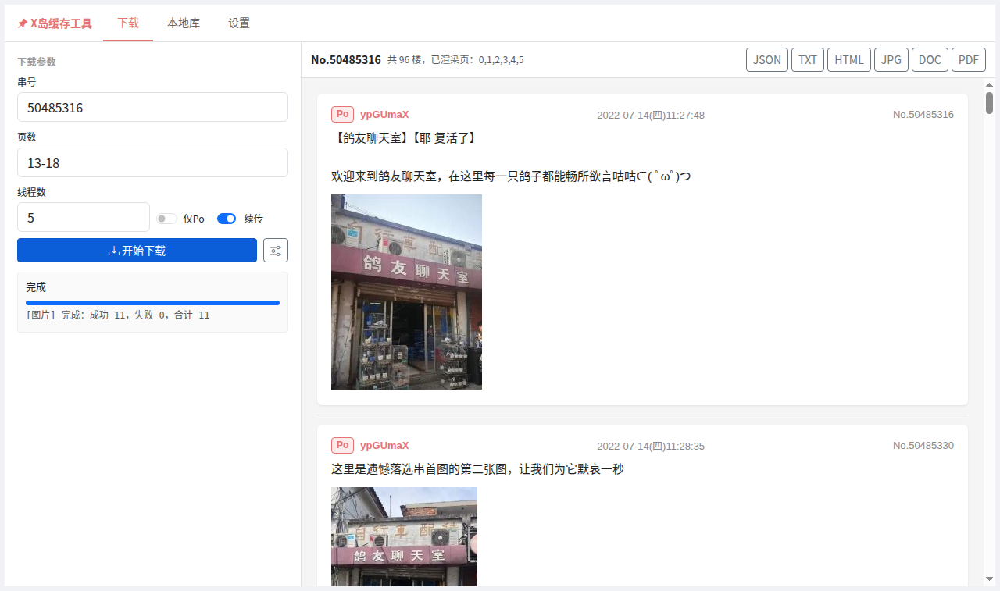
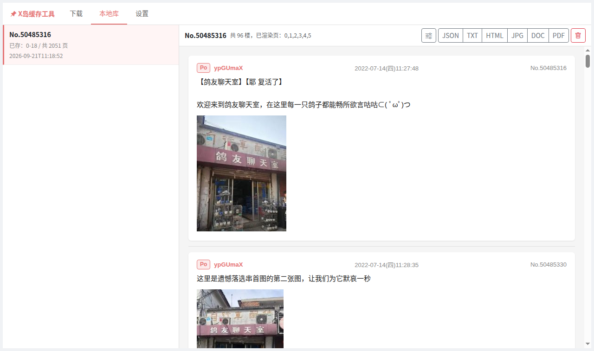
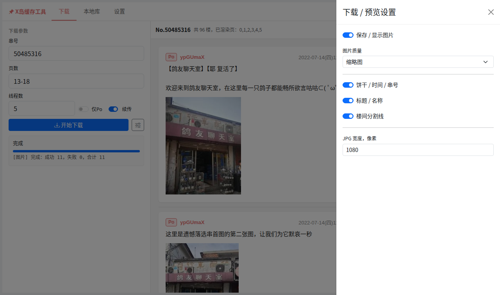

# nmb-exporter

[X岛](https://www.nmbxd.com/)串内容缓存与导出工具：把指定的串连同图片抓取到本地，在网页里浏览，并导出为 **JSON / TXT / JPG / DOC / PDF / HTML** 六种格式。

[](https://www.gnu.org/licenses/agpl-3.0)
[](https://www.python.org/)

---

## 界面演示

### 下载与实时进度

左侧填写串号与页数即可开始下载，进度条与状态行通过 SSE 实时推送；右侧同步渲染预览，右上角为导出按钮。



### 本地库阅读

已缓存的串会出现在「本地库」中，按楼展示正文、图片与 PO 标记，可随时导出或删除。



### 显示与导出设置

可切换图片保存与质量、是否显示页头 / 元信息 / 楼间分割线，并设置 JPG 导出宽度。



## 功能特性

- **串抓取**：按串号分页下载正文，支持「只看 PO」、指定页范围；开启断点续传后重复抓取会自动跳过已缓存页
- **并发与限速**：多线程下载 + 全局 `RateLimiter`，遇到 HTTP 429 时指数退避（5s 起，翻倍，上限 60s），请求成功即复位
- **图片本地化**：调用官方 `getCDNPath` 接口自动挑选带宽最高的 CDN，支持缩略图 / 原图，落盘缓存并支持重试
- **多格式导出**：JSON、纯文本、长图（JPG）、Word 文档（DOC）、PDF、HTML；可选页头、元信息、分隔线，JPG 可指定宽度
- **Web UI**：Flask 界面，含串列表、在线预览、图片查看、导出下载、SSE 实时下载进度，以及 Cookie 二维码上传解析
- **Cookie 管理**：支持扫码二维码图片（`pyzbar` 或 `OpenCV` 两种解析后端）写入配置，或直接粘贴 userhash
- **本地索引**：`data/index.json` 保存所有已缓存串，便于浏览与去重

## 环境要求

- Python 3.8 或更高版本
- 可访问 `https://api.nmb.best` 与图片 CDN 的网络环境
- 一个有效的 X岛账号 Cookie（`userhash`）
- Linux 下若使用二维码识别，需要系统库 `libzbar`（见下方说明）

## 安装

```bash
git clone https://github.com/K-02-b/nmb-exporter.git
cd nmb-exporter

python -m venv .venv
source .venv/bin/activate        # Windows: .venv\Scripts\activate
pip install -r requirements.txt
```

二维码解析依赖 `pyzbar` 与 `opencv-python`（代码中两者任选其一，优先 `pyzbar`）。若 `pyzbar` 报缺少共享库，安装系统依赖即可：

```bash
# Debian / Ubuntu
sudo apt install libzbar0
# macOS
brew install zbar
```

## 配置

工具需要一个 X岛 `userhash` 作为身份凭证。按以下优先级读取：

1. 命令行参数 `--user-hash`
2. 环境变量 `NM_USER_HASH`
3. `config.json` 中的 `cookie` 字段
4. 环境变量 `USER_HASH`

支持 `.env` 文件（通过 `python-dotenv` 自动加载）。手动创建 `config.json`：

```json
{
  "cookie": "你的 userhash",
  "name": "你的用户名"
}
```

也可以由二维码图片自动生成 —— 图片内容为 `{"cookie": "...", "name": "..."}` JSON 或直接的 userhash 字符串：

```bash
python parse_qrcode.py qrcode.png              # 默认写入 config.json
python parse_qrcode.py qrcode.png --config my.json
```

> `config.json` 与 `data/` 已在 `.gitignore` 中忽略，请勿把 Cookie 提交到仓库。

## 使用方式

### Web UI（推荐）

```bash
python webui.py
```

启动后访问 <http://127.0.0.1:5000>（默认监听 `0.0.0.0:5000`）。界面可以：

- 保存 Cookie 或上传二维码图片自动解析
- 填写串号下载，可设置页数范围（如 `1-3,5`）、线程数、仅 PO、断点续传
- 查看实时下载进度，在线预览串内容与图片
- 一键导出 JSON / TXT / HTML / JPG / DOC / PDF
- 管理本地已缓存的串（查看、删除）

### 命令行抓取

```bash
# 抓取整串并导出为 JSON（默认格式）
python thread.py 50000001

# 只看 PO，并保存缩略图
python thread.py 50000001 --only-po --save-images

# 只抓第 1~3 页，多线程 10，导出 PDF
python thread.py 50000001 --pages 1-3 --threads 10 --format pdf -o out.pdf

# 保存原图，并导出宽度 1080 的长图
python thread.py 50000001 --save-images --image-quality image --format jpg --width 1080

# 开启断点续传，仅导出第 1、2、5 页
python thread.py 50000001 --resume --export-pages 1,2,5 --format txt
```

| 参数 | 说明 |
| --- | --- |
| `thread_id` | 串号（必填） |
| `--only-po` | 只抓取 PO 的发言 |
| `--user-hash` | 指定 userhash，覆盖环境变量与配置 |
| `--pages` | 抓取页范围，可重复传入，支持 `1-3,5` 写法 |
| `--threads` | 并发线程数，默认 5 |
| `--resume` | 断点续传（跳过已下载页）；Web UI 中默认开启，命令行需显式指定 |
| `--format` | 导出格式：`json`/`txt`/`jpg`/`doc`/`pdf`/`html`，默认 `json` |
| `--output` / `-o` | 输出文件路径 |
| `--export-pages` | 导出时只包含指定页（自动包含第 0 页） |
| `--no-header` / `--no-meta` / `--no-divider` | 关闭页头 / 元信息 / 分隔线 |
| `--width` | JPG 导出宽度，默认 1080 |
| `--save-images` | 同时下载图片并嵌入导出结果 |
| `--image-quality` | 图片质量：`thumb`（缩略图）或 `image`（原图），默认 `thumb` |

### 单独导出已有数据

```bash
python export.py data/50000001.json -f html -o out.html
python export.py data/50000001.json -f jpg --width 1080 --image-quality thumb
python export.py data/50000001.json -f pdf --no-divider
```

| 参数 | 说明 |
| --- | --- |
| `input` | 输入 JSON 文件（即 `data/<串号>.json`） |
| `-f` / `--format` | 输出格式，默认 `txt` |
| `-o` / `--output` | 输出路径，默认为输入文件名加上目标格式后缀 |
| `--no-header` / `--no-meta` / `--no-divider` | 关闭页头 / 元信息 / 分隔线 |
| `--width` | JPG 宽度，默认 1080 |
| `--image-quality` | 指定后会将图片嵌入导出文件 |

> 导出为 `doc` 时由 `python-docx` 生成，内容实为 OOXML（`.docx`）格式但扩展名为 `.doc`。若 Word 提示格式与扩展名不符，把文件改名为 `.docx` 即可正常打开。

### 二维码解析

```bash
python parse_qrcode.py <二维码图片路径> [--config config.json]
```

## 数据目录结构

```
data/
├── index.json                  # 所有已缓存串的索引（Web UI 列表来源）
├── <串号>.json                 # 正文，按页存储：{"0": [OP], "1": [...], ...}
├── <串号>.meta.json            # 已抓取的页号等元信息
├── <串号>_po.json              # 「只看 PO」模式下的对应文件
├── <串号>_po.meta.json
└── images/<串号>/<quality>/<ext>   # 图片缓存，quality 为 thumb / image

.temp/<串号>/page<N>.json       # 下载过程中的分页临时文件
```

## 项目结构

```
├── thread.py           # 抓取与缓存核心 + 命令行入口
├── export.py           # 六种格式的导出实现（JSON/TXT/JPG/DOC/PDF/HTML）
├── images.py           # CDN 选择、图片下载与缓存
├── parse_qrcode.py     # 二维码 Cookie 解析
├── webui.py            # Flask Web UI 与 REST / SSE 接口
├── templates/index.html
├── static/css, static/js   # Bootstrap 5 前端资源
├── fonts/              # JPG / PDF 渲染所需字体（含 CJK）
└── requirements.txt
```

## Web UI 接口

| 方法 | 路径 | 说明 |
| --- | --- | --- |
| `GET` / `POST` | `/api/config` | 读取 / 写入 Cookie 配置 |
| `POST` | `/api/config/qrcode` | 上传二维码图片并解析 Cookie |
| `GET` | `/api/threads` | 已缓存串列表 |
| `DELETE` | `/api/thread/<tid>` | 删除指定串的本地数据 |
| `GET` | `/api/preview?tid=&po=&pages=` | 分页预览串内容 |
| `GET` | `/api/image/<tid>/<quality>/<path>` | 读取本地缓存的图片 |
| `GET` | `/api/export/<fmt>?tid=&po=&pages=` | 导出并下载 |
| `GET` | `/api/download_stream?tid=&only_po=&pages=&threads=&save_images=&image_quality=` | SSE 实时下载进度 |

## 说明与免责声明

- 本项目仅用于**个人备份与阅读**，请遵守 X岛的使用条款及相关法律法规。
- 请勿高频请求站点。工具已内置 429 退避与并发限制，请勿移除或绕过这些限制。
- 导出的串内容版权归原作者所有，请勿用于商业用途或未经许可的二次传播。
- Cookie(`userhash`) 等同于账号凭证，请妥善保管，切勿提交到公开仓库或分享给他人。
- Web UI 默认监听 `0.0.0.0:5000` 且**不带任何登录鉴权**，任何能访问该端口的人都可以读取你的缓存与 Cookie 配置，因此请勿将其直接暴露到公网；确需远程访问时，请自行通过反向代理并添加访问控制。
- `fonts/` 目录中的 Noto 系列字体遵循 SIL Open Font License 1.1；如再分发本项目，请自行确认其余字体资源的授权。

## 许可证

本项目基于 [GNU Affero General Public License v3.0](LICENSE) 发布。

```
Copyright (C) 2026 K-02-b
```

AGPL-3.0 是强 Copyleft 协议：你可以自由使用、修改和分发本项目，但**衍生作品必须同样以 AGPL-3.0 开源**；并且如果你修改后将其作为网络服务提供给他人使用，也必须向使用者提供对应的源代码。
